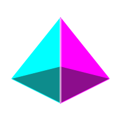

<div align="center">



# Osiris IDE

**A custom, open-source developer platform built from VS Code (Code - OSS / VSCodium core) — for desktop and the browser.**

[](https://github.com/osiris-ide/osiris/actions/workflows/ci.yml)
[](LICENSE)

</div>

---

## What is this?

Osiris IDE is a **downstream distribution** of [Code - OSS](https://github.com/microsoft/vscode)
(assembled through the [VSCodium](https://github.com/VSCodium/vscodium) pipeline) with:

- **Osiris branding** — product name, icons, theme defaults (`Osiris Dark` / `Osiris Light`).
- **First-party extensions** shipped in the box:
  - `osiris-ai` — AI agent orchestration with **MCP (Model Context Protocol)** support and a custom agent panel.
  - `osiris-dexpi` — **DEXPI** (XML / P&ID) parser, SVG visualizer and schema validator.
  - `osiris-step` — **ISO 10303-21** (`.step` / `.stp`) parser with a 3D WebGL preview.
- Two delivery targets:
  - `apps/osiris-desktop` — Electron packages for Linux, macOS and Windows.
  - `apps/osiris-web` — a browser-served runtime following the OpenVSCode Server pattern.

> The upstream VS Code source is **never vendored** into this repo. The desktop/web
> builds clone a pinned upstream tag at build time and apply Osiris overlays + patches.

## Repository layout

```text
osiris/
├── apps/
│   ├── osiris-desktop/   # Electron wrapper, OS packaging, branding entrypoint
│   ├── osiris-web/       # Web runtime / standalone server
│   ├── osiris-server/    # REST API: git hosting, sessions, crew / backlog / memory
│   └── osiris-console/   # Lightweight SPA — Kanban board, crew runner, KB search
├── packages/
│   ├── branding/         # Icons, themes, product.json overlay, asset metadata
│   ├── shell-theme/      # Theme provider + OS / host theme detection
│   ├── shared-core/      # Shared utilities, types, telemetry & event bus
│   ├── protocol/         # zod wire contracts (sessions, crew, backlog, memory)
│   ├── agent-core/       # Provider-agnostic single-agent loop + snapshot
│   ├── dot-osiris/       # The .osiris/ layout resolver + bundled system template
│   ├── memory/           # Knowledge base: chunking + incremental ChromaDB index
│   ├── mcp/              # MCP client (stdio + HTTP) + crew tool adapter
│   ├── lm-proxy/         # OpenAI-compatible shim over the editor Language Model API
│   ├── crew/             # Multi-agent orchestration (coordinator + delegation)
│   ├── backlog/          # File-based PM on a Git orphan branch
│   └── cli/              # The `osiris` command + REPL
├── extensions/
│   ├── osiris-ai/        # AI agent orchestration + MCP + agent panel
│   ├── osiris-dexpi/     # DEXPI (P&ID) parser, visualizer, validator
│   ├── osiris-step/      # ISO 10303-21 STEP parser + 3D preview
│   └── osiris-workspace/ # DevContainer enforcement + session handover
└── toolchain/
    ├── eslint-config/    # Shared flat ESLint config
    └── tsconfig/         # Shared TypeScript base configs
```

## Prerequisites

- **Node.js 22 LTS** (`nvm use` reads `.nvmrc`)
- **pnpm 9** (`corepack enable`)
- For desktop builds: the platform toolchain VS Code itself requires
  (`git`, Python 3, a C/C++ compiler, and on Linux the `libx11`/`libsecret` dev packages).

## Quickstart

```bash
corepack enable
pnpm install

pnpm build        # build every package + extension (Turborepo)
pnpm test         # vitest across packages + extension logic
pnpm lint         # eslint (flat config)
pnpm typecheck    # tsc -b across the workspace
```

## Multi-agent crew, knowledge base & Git backlog

Osiris projects are driven from a `.osiris/` folder (the same folder VS Code reads
as `.vscode`). Anything missing there falls back to the bundled system template in
`@osiris/dot-osiris`.

```text
.osiris/
├── agents/     # crew members — <name>.md with a YAML frontmatter header
├── memory/     # knowledge base — every .md is chunked + indexed into ChromaDB
├── backlog/    # file-based PM — PROCESS.md + one sub-folder per workflow state
├── actions/    # portable CI templates (GitHub / Gitea / Forgejo Actions)
├── temp/       # agent scratchpads — always git-ignored
├── crew.json   # crew roster + coordinator policy
├── memory.json # ChromaDB connection + indexing policy
└── mcp.json    # MCP servers, merged with the editor's discovered set
```

The `osiris` CLI (`@osiris/cli`) ties it together:

```bash
osiris init                       # scaffold .osiris/ from the system template
osiris agent list                 # the crew defined in .osiris/agents/
osiris crew run "add a foo parser" # coordinator drives the lead agent; it delegates
osiris memory reindex             # (re)index .osiris/memory/ — incremental, content-addressed
osiris memory search "orphan branch"
osiris backlog new "Parser crash" --type bug
osiris backlog move 12 review     # git mv + one commit on the orphan branch osiris/backlog
osiris backlog push / pull        # sync osiris/backlog with a git remote (OSIRIS_BACKLOG_REMOTE)
osiris backlog lint               # static-check every task file
osiris serve                      # REST API + Kanban console at http://localhost:8080
                                  # or: docker compose -f apps/osiris-server/docker-compose.yml up --build
osiris repl                       # interactive REPL with crew/backlog/memory in scope
```

- **Models** come from the VS Code Language Model API (`model: vscode-lm/…` in an
  agent file). In the editor the crew calls it directly; a container-side crew
  reaches it through the **LM proxy** (`@osiris/lm-proxy` — an OpenAI-compatible
  shim over `vscode.lm`, published as `OSIRIS_LM_PROXY_URL`). CLI/CI runs with no
  editor use a headless fallback (`OSIRIS_CREW_PROVIDER`, `OSIRIS_AI_API_KEY`).
- **MCP** servers are taken from `.osiris/mcp.json` (both the `servers` and the
  VS Code `mcpServers` key; `${workspaceFolder}` / `${env:VAR}` are expanded).
  An agent opts in with an `mcp` (all servers) or `mcp:<id>` selector in its
  `tools:` list; `@osiris/mcp` starts them (stdio or Streamable HTTP), exposes
  each tool as `<id>__<tool>`, and a server that won't start is skipped, not
  fatal. `osiris crew run --mcp` / `OSIRIS_MCP=1` forces the pool even when no
  agent asks. Osiris manages no credentials of its own.
- **All tool execution** runs inside the `.devcontainer` (Node 22 + a ChromaDB
  service; see `.devcontainer/docker-compose.yml`).
- **The backlog never touches source history** — it lives on the dedicated
  orphan branch `osiris/backlog`, operated through a worktree under `.osiris/temp/`.

In the editor, **Osiris: Run Crew on a Task…** and **Osiris: Open Console** (from
`osiris-workspace`) drive the same server over its typed `ConsoleClient`,
streaming crew events to an output channel.

See [docs/crew-architecture.md](docs/crew-architecture.md) for the full design.

### Working on an extension

```bash
pnpm --filter osiris-dexpi build
pnpm --filter osiris-dexpi test
pnpm --filter osiris-dexpi package     # produces osiris-dexpi-*.vsix
```

Press <kbd>F5</kbd> with one of the committed launch profiles in
[`.osiris/launch.json`](.osiris/launch.json) to run an extension in an Extension
Development Host against the fixtures in each extension's `test/fixtures/`.
(Osiris reads the workspace config folder as `.osiris/`; `.vscode` is a symlink so
stock VS Code / Cursor still work.)

### Building the desktop app

```bash
pnpm --filter @osiris/desktop prepare    # clone pinned VSCodium tag + apply branding/patches
pnpm --filter @osiris/desktop build
pnpm --filter @osiris/desktop package    # electron-builder → apps/osiris-desktop/dist_electron
```

### Building / running the web runtime

```bash
pnpm --filter @osiris/web prepare
pnpm --filter @osiris/web build
node apps/osiris-web/server/index.mjs --port 3000
# or:
docker build -t osiris-web apps/osiris-web && docker run -p 3000:3000 osiris-web
```

## Build matrix

| Target                | Command                                 | CI workflow         | Output                            |
| --------------------- | --------------------------------------- | ------------------- | --------------------------------- |
| Packages / exts       | `pnpm build`                            | `ci.yml`            | `dist/`, `media/`, `*.vsix`       |
| Desktop (Lin/Mac/Win) | `pnpm --filter @osiris/desktop package` | `build-desktop.yml` | AppImage / deb / rpm / dmg / nsis |
| Web + Docker          | `pnpm --filter @osiris/web build`       | `build-web.yml`     | server bundle + container image   |
| Release               | tag `v*`                                | `release.yml`       | GitHub Release with all artifacts |

## Contributing

See [CONTRIBUTING.md](CONTRIBUTING.md) and the [Code of Conduct](CODE_OF_CONDUCT.md).
Security reports: [SECURITY.md](SECURITY.md).

## License

[MIT](LICENSE). Osiris IDE is not affiliated with or endorsed by Microsoft.
"Visual Studio Code" and the VS Code logo are trademarks of Microsoft; Osiris
ships none of Microsoft's trademarked assets.
